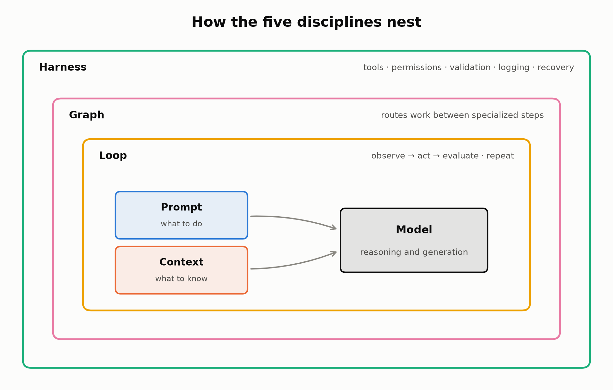

# Prompt, context, harness, loop, and graph engineering

A guide to the five layers of a working AI system, in one Jupyter notebook.

Most failures in AI products get blamed on the prompt. Usually the prompt is
fine and the problem lives somewhere else: the model never saw the right
information, the tooling around it was too weak to act, the agent's loop had no
stop condition, or the workflow routed the task down the wrong branch. The
notebook takes these five layers one at a time — prompt, context, harness,
loop, graph — with definitions, diagrams, failure modes, and a design
checklist for each. It ends with a symptom-to-layer debugging table and a
small state machine you can run to watch a research loop hit its stop
conditions.



Every figure sticks to one color per layer (prompt blue, context orange,
harness teal, loop amber, graph magenta), so the bigger architecture diagrams
stay readable once you know the code.

## Reading and running it

GitHub renders the notebook with all figures embedded, so you can read it
right here: [`ai_systems_engineering_guide.ipynb`](ai_systems_engineering_guide.ipynb)

To re-run or edit the cells, the only dependency is matplotlib:

```
pip install matplotlib
```

## License

MIT. Use it for whatever — a star is appreciated if it was useful.
